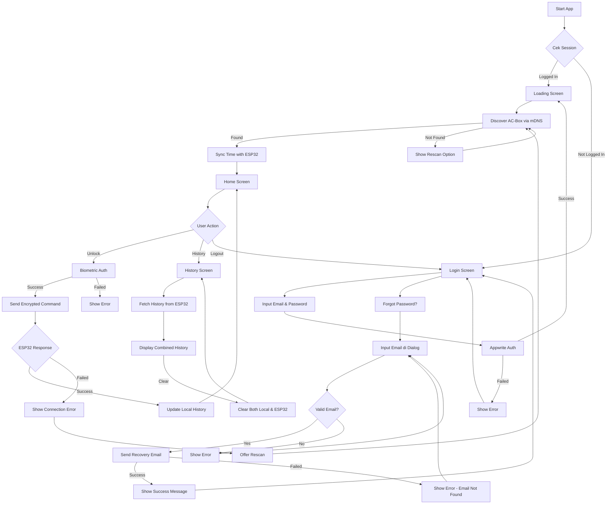
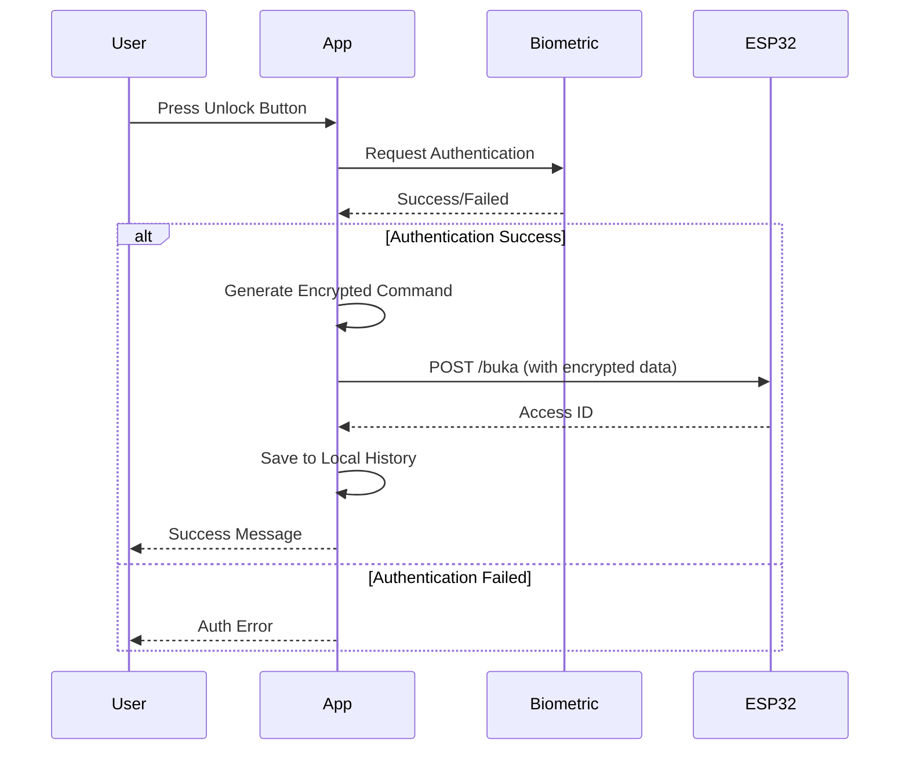
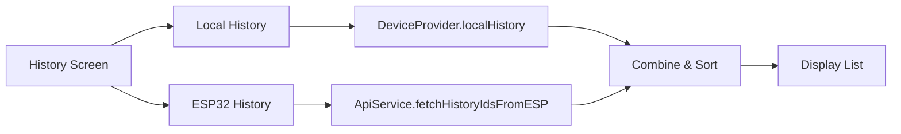

# 📱 Dokumentasi Project AC-Box

## 🎯 Ringkasan Project

**AC-Box** adalah aplikasi mobile berbasis **Flutter** yang berfungsi sebagai **sistem kontrol akses pintu pintar** menggunakan perangkat **ESP32/AC-Box hardware**. Aplikasi ini memungkinkan pengguna untuk membuka kunci pintu secara remote melalui smartphone dengan autentikasi biometrik (sidik jari) dan mengelola riwayat akses.

---

## 🏗️ Arsitektur Aplikasi

### **Technology Stack**

| Komponen | Teknologi |
|----------|-----------|
| **Framework** | Flutter (SDK ≥3.0.0) |
| **State Management** | Provider |
| **Backend/Auth** | Appwrite |
| **Network** | HTTP untuk komunikasi dengan ESP32 |
| **Local Storage** | SharedPreferences |
| **Biometric Auth** | local_auth |
| **Encryption** | encrypt package |
| **UI/Typography** | Google Fonts |

### **Struktur Folder**

```
lib/
├── main.dart                    # Entry point aplikasi
├── models/                      # Data models
│   └── access_log_entry.dart    # Model untuk log akses
├── providers/                   # State management
│   └── device_provider.dart     # Provider untuk manajemen perangkat ESP32
├── screens/                     # UI Screens
│   ├── login_screen.dart        # Halaman login
│   ├── loading_screen.dart      # Halaman loading/discovery perangkat
│   ├── home_screen.dart         # Halaman utama kontrol akses
│   └── history_screen.dart      # Halaman riwayat akses
└── services/                    # Business logic services
    ├── api_service.dart         # Service untuk komunikasi dengan ESP32
    └── auth_service.dart        # Service untuk autentikasi biometrik
```

---

## 🔐 Fitur Utama

### 1. **Autentikasi Pengguna**
- **Login dengan Email/Password** menggunakan Appwrite
- **Auto-save email** yang pernah login dengan SharedPreferences
- **Autocomplete** untuk email yang tersimpan
- **Forgot Password** - reset password via email
- **Session management** otomatis

### 2. **Device Discovery**
- **Automatic discovery** perangkat AC-Box menggunakan mDNS (hostname: `ac-box.local`)
- **DNS lookup** untuk menemukan IP address ESP32
- **Rescan functionality** jika perangkat tidak ditemukan
- **Error handling** yang informatif

### 3. **Kontrol Akses Pintu**
- **Autentikasi biometrik** (sidik jari) sebelum membuka kunci
- **Komunikasi terenkripsi** dengan ESP32 menggunakan AES encryption
- **Unlock command** via HTTP ke ESP32
- **Real-time feedback** status unlock
- **Connection error handling** dengan retry mechanism

### 4. **Manajemen Riwayat Akses**
- **Local history** disimpan di aplikasi
- **ESP32 history** disinkronkan dari perangkat
- **Timestamp** setiap akses dengan format lengkap
- **Clear history** untuk menghapus semua riwayat
- **Sinkronisasi waktu** antara smartphone dan ESP32

### 5. **UI/UX Modern**
- **iOS-inspired design** dengan aesthetics modern
- **Smooth animations** dan transitions
- **Dark color scheme** yang elegan
- **Google Fonts** (Inter) untuk typography
- **Responsive layout** untuk berbagai ukuran layar

---

## 🔄 Alur Kerja Aplikasi

### **Flow Chart Umum**



---

## 📋 Penjelasan Detail Setiap Komponen

### **1. main.dart** - Entry Point Aplikasi

**Fungsi Utama:**
- Inisialisasi **Appwrite Client** dengan endpoint dan project ID
- Setup **MultiProvider** untuk dependency injection
- Konfigurasi **routing** aplikasi
- Implementasi **AuthWrapper** untuk cek status login

**Konfigurasi Penting:**
```dart
const String kAppwriteProjectId = '69366f1e00362425e129';
const String kAppwriteEndpoint = 'https://sgp.cloud.appwrite.io/v1';
```

**Routes:**
- `/` → AuthWrapper (cek login status)
- `/login` → LoginScreen
- `/loading` → LoadingScreen

---

### **2. LoginScreen** - Halaman Autentikasi

**Fitur:**
- Form email & password dengan validasi
- **Autocomplete** untuk email yang pernah digunakan
- **Save email** otomatis setelah login sukses
- **Forgot Password** dengan dialog modern
- **Modern UI** dengan glassmorphism effect
- Error handling yang user-friendly

**Flow Login:**
1. User input email & password
2. Validasi form
3. Kirim ke Appwrite untuk autentikasi
4. Jika sukses:
   - Save email ke SharedPreferences
   - Navigate ke LoadingScreen
5. Jika gagal:
   - Tampilkan error message

**Forgot Password Flow:**
1. User klik tombol "Forgot Password?"
2. Dialog muncul dengan form input email
3. User masukkan email terdaftar
4. Validasi email format
5. Kirim request ke Appwrite:
   ```dart
   await account.createRecovery(
     email: emailController.text,
     url: 'https://sgp.cloud.appwrite.io/console',
   );
   ```
6. Jika sukses:
   - Tampilkan success message
   - User cek inbox email untuk link reset password
7. Jika gagal (misal: email tidak terdaftar):
   - Tampilkan error message

**Forgot Password Dialog Features:**
- Modern iOS-inspired design
- Email validation (format check)
- Loading state saat proses pengiriman
- Error handling untuk berbagai kasus:
  - Email tidak ditemukan (404)
  - Network error
  - Invalid format
- Success/error feedback via SnackBar

**SharedPreferences Keys:**
- `saved_emails` → List email yang pernah login (JSON array)

---

### **3. LoadingScreen** - Device Discovery

**Fungsi Utama:**
- **Mencari perangkat AC-Box** di jaringan lokal
- **DNS lookup** untuk hostname `ac-box.local`
- **Sinkronisasi waktu** dengan ESP32
- **Error handling** jika perangkat tidak ditemukan

**Discovery Process:**
```dart
// Menggunakan DeviceProvider
await deviceProvider.discoverDeviceByHostname();

// DNS Lookup
final addresses = await InternetAddress.lookup('ac-box.local');

// Ambil IPv4 address pertama
deviceIpAddress = addresses.first.address;
```

**Sync Time:**
```dart
// Kirim Unix timestamp ke ESP32
await ApiService.syncTimeESP(ipAddress);
```

**UI States:**
- Loading → Mencari perangkat
- Found → Navigasi ke HomeScreen
- Error → Tampilkan pesan & tombol rescan

---

### **4. HomeScreen** - Halaman Utama

**Fitur Utama:**
- **Tombol Unlock** dengan biometric authentication
- **Status connection** ke ESP32
- **Navigation** ke History Screen
- **Logout** functionality
- **Encrypted communication** dengan ESP32

**Unlock Process:**



**Encryption Details:**
- **Algorithm:** AES (128-bit)
- **Mode:** CBC
- **Key:** Hardcoded (harus sama dengan ESP32)
- **IV:** Hardcoded (harus sama dengan ESP32)

**Command Format:**
```dart
// Plain command
String command = "UNLOCK";

// Encrypt
final encrypted = encrypter.encrypt(command, iv: iv);

// Send as JSON
{
  "cmd": base64(encrypted)
}
```

---

### **5. HistoryScreen** - Riwayat Akses

**Fitur:**
- **Dual source history:**
  - Local history (dari aplikasi)
  - ESP32 history (dari perangkat)
- **Combined display** dengan timestamp
- **Pull-to-refresh** untuk refresh data
- **Clear history** untuk semua riwayat
- **Formatting tanggal** yang user-friendly

**Data Flow:**


**API Endpoints ESP32:**
- `GET /riwayat` → Ambil array ID akses
- `GET /hapus_riwayat` → Hapus semua riwayat di ESP32

**Date Formatting:**
```dart
// Format: "Senin, 13 Des 2025 14:30:45"
DateFormat('EEEE, d MMM y HH:mm:ss', 'id_ID')
```

---

### **6. DeviceProvider** - State Management

**Responsibilities:**
- Manage IP address perangkat AC-Box
- Handle device discovery process
- Manage loading states
- Store local access history
- Provide rescan functionality

**State Variables:**
```dart
String? _deviceIpAddress;        // IP ESP32
bool _isLoading;                 // Status loading
bool _isScanning;                // Status scanning
List<String> _foundDevices;      // List IP yang ditemukan
String? _lastError;              // Error message
List<AccessLogEntry> _localHistory; // Riwayat lokal
```

**Key Methods:**
- `discoverDeviceByHostname()` → Cari perangkat via mDNS
- `rescanDevice()` → Scan ulang perangkat
- `addAccessLogLocally()` → Tambah entry ke history
- `clearLocalHistory()` → Hapus semua history lokal

---

### **7. ApiService** - ESP32 Communication

**Endpoints:**

| Endpoint | Method | Fungsi | Response |
|----------|--------|--------|----------|
| `/buka` | POST | Unlock door | Access ID (int) |
| `/riwayat` | GET | Get history | Array of IDs |
| `/hapus_riwayat` | GET | Clear history | 200 OK |
| `/set_time` | GET | Sync time | 200 OK |

**Example Usage:**
```dart
// Unlock door
final accessId = await ApiService.unlockDoorAndGetId(ipAddress);

// Fetch history
final historyIds = await ApiService.fetchHistoryIdsFromESP(ipAddress);

// Clear history
final success = await ApiService.clearHistoryOnESP(ipAddress);

// Sync time
final synced = await ApiService.syncTimeESP(ipAddress);
```

---

### **8. AuthService** - Biometric Authentication

**Fungsi:**
- Check biometric capability
- Authenticate dengan fingerprint
- Handle errors & permissions

**Implementation:**
```dart
final authenticated = await AuthService.authenticate();

// Internal process:
// 1. Check canCheckBiometrics
// 2. Check isDeviceSupported
// 3. Show biometric prompt
// 4. Return true/false
```

**Error Handling:**
- No biometric sensor → Print error
- No fingerprint enrolled → Print error
- Authentication failed → Return false
- Permission denied → Print error

---

## 🔧 Konfigurasi & Setup

### **1. Appwrite Setup**

**Requirements:**
- Appwrite instance (cloud atau self-hosted)
- Project ID
- Endpoint URL

**Update di main.dart:**
```dart
const String kAppwriteProjectId = 'YOUR_PROJECT_ID';
const String kAppwriteEndpoint = 'YOUR_ENDPOINT_URL';
```

**Appwrite Console Setup:**
1. Create new project
2. Enable **Email/Password** authentication
3. Add platform (Android/iOS) dengan bundle ID
4. Copy Project ID & Endpoint

---

### **2. ESP32 Setup**

**Network Requirements:**
- ESP32 harus terhubung ke **WiFi yang sama** dengan smartphone
- Enable **mDNS** dengan hostname `ac-box.local`
- Pastikan firewall tidak memblokir HTTP traffic

**HTTP Server Endpoints (ESP32 Side):**

```cpp
// Unlock endpoint - POST /buka
server.on("/buka", HTTP_POST, []() {
  // Decrypt command dari body
  // Jika valid, unlock door
  // Return access ID
  server.send(200, "text/plain", String(accessId));
});

// History endpoint - GET /riwayat
server.on("/riwayat", HTTP_GET, []() {
  // Return JSON array of access IDs
  server.send(200, "application/json", historyJSON);
});

// Clear history - GET /hapus_riwayat
server.on("/hapus_riwayat", HTTP_GET, []() {
  // Clear local storage
  server.send(200, "text/plain", "OK");
});

// Time sync - GET /set_time?timestamp=xxx
server.on("/set_time", HTTP_GET, []() {
  // Update RTC with timestamp
  server.send(200, "text/plain", "OK");
});
```

**Encryption Setup (ESP32):**
```cpp
// Harus sama dengan Flutter app
const char* key = "1234567890123456"; // 16 bytes
const char* iv = "1234567890123456";  // 16 bytes
```

---

### **3. Build & Run**

**Prerequisites:**
```bash
flutter --version  # ≥3.0.0
dart --version     # ≥3.0.0
```

**Install Dependencies:**
```bash
flutter pub get
```

**Run App:**
```bash
# Android
flutter run

# iOS
flutter run -d ios

# Specific device
flutter run -d <device-id>
```

**Build APK:**
```bash
flutter build apk --release
```

**Build iOS:**
```bash
flutter build ios --release
```

---

## 📝 Configuration Files

### **pubspec.yaml**

**Key Dependencies:**
```yaml
dependencies:
  flutter:
    sdk: flutter
  
  # Backend & Auth
  appwrite: ^20.3.2
  
  # Network & HTTP
  http: ^1.2.2
  
  # State Management
  provider: ^6.1.2
  
  # Biometric Auth
  local_auth: ^2.3.0
  
  # Encryption
  encrypt: ^5.0.0
  
  # Local Storage
  shared_preferences: ^2.2.2
  
  # UI/UX
  google_fonts: ^6.1.0
  cupertino_icons: ^1.0.2
  
  # Utilities
  intl: ^0.19.0
```

**Assets:**
```yaml
flutter:
  assets:
    - assets/logoacbox.png
```

**App Icon:**
```yaml
flutter_launcher_icons:
  android: true
  ios: true
  image_path: "assets/logoacbox.png"
```

---

## 🎨 Design System

### **Color Palette**

```dart
// Primary Colors
const primaryColor = Color(0xFF1C1C1E);      // Dark background
const secondaryColor = Color(0xFF2C2C2E);    // Card background
const accentColor = Color(0xFF007AFF);       // iOS Blue

// Text Colors
const textPrimary = Color(0xFFFFFFFF);       // White
const textSecondary = Color(0xFF8E8E93);     // Gray

// Status Colors
const successColor = Color(0xFF34C759);      // Green
const errorColor = Color(0xFFFF3B30);        // Red
const warningColor = Color(0xFFFF9500);      // Orange
```

### **Typography**

```dart
// Using Google Fonts - Inter
TextStyle displayLarge = GoogleFonts.inter(
  fontSize: 32,
  fontWeight: FontWeight.bold,
  color: textPrimary,
);

TextStyle bodyMedium = GoogleFonts.inter(
  fontSize: 16,
  fontWeight: FontWeight.normal,
  color: textPrimary,
);
```

### **UI Components**

**Modern TextField:**
- Rounded corners (12px)
- Subtle border
- Focus state animation
- Prefix/suffix icon support

**Modern Button:**
- Gradient background
- Rounded corners (16px)
- Shadow effect
- Scale animation on press

**Cards:**
- Glassmorphism effect
- Backdrop blur
- Subtle shadow
- Rounded corners (20px)

---

## 🐛 Troubleshooting

### **Problem: AC-Box tidak ditemukan**

**Penyebab:**
- ESP32 tidak terhubung ke WiFi yang sama
- mDNS tidak aktif di ESP32
- Firewall memblokir DNS queries

**Solusi:**
1. Pastikan smartphone & ESP32 di WiFi yang sama
2. Restart ESP32 dan smartphone
3. Gunakan tombol "Scan Ulang"
4. Cek log di ESP32 serial monitor

---

### **Problem: Autentikasi biometrik gagal**

**Penyebab:**
- Tidak ada sidik jari terdaftar di device
- Permission tidak granted
- Sensor tidak didukung

**Solusi:**
1. Daftarkan sidik jari di Settings device
2. Grant permission biometric di app settings
3. Cek `local_auth` package compatibility

---

### **Problem: Unlock command tidak bekerja**

**Penyebab:**
- ESP32 offline atau restart
- Encryption key/IV tidak match
- Network timeout

**Solusi:**
1. Cek koneksi ESP32 (ping IP address)
2. Verifikasi key & IV sama di Flutter & ESP32
3. Tambahkan timeout handling
4. Gunakan "Scan Ulang" untuk reconnect

---

### **Problem: Riwayat tidak sinkron**

**Penyebab:**
- ESP32 storage penuh
- Waktu ESP32 tidak sync
- Network error saat fetch

**Solusi:**
1. Clear history di ESP32
2. Sync time ulang (otomatis di loading screen)
3. Pull-to-refresh di History Screen

---

### **Problem: Email reset password tidak diterima**

**Penyebab:**
- Email tidak terdaftar di Appwrite
- Email masuk ke folder spam
- SMTP settings Appwrite belum dikonfigurasi
- Network timeout

**Solusi:**
1. Pastikan email sudah terdaftar (coba login dulu)
2. Cek folder spam/junk di email
3. Tunggu beberapa menit (email kadang delayed)
4. Verifikasi SMTP settings di Appwrite Console
5. Coba kirim ulang reset email

---

## 🔒 Security Considerations

> [!WARNING]
> **Security Concerns:**

1. **Hardcoded Encryption Keys**
   - Key & IV di-hardcode di source code
   - **Risk:** Jika APK di-reverse engineering, key bisa didapat
   - **Recommendation:** Gunakan secure key storage (e.g., Flutter Secure Storage)

2. **HTTP Communication**
   - Komunikasi ke ESP32 menggunakan HTTP (not HTTPS)
   - **Risk:** Man-in-the-middle attack
   - **Recommendation:** Implementasi HTTPS di ESP32

3. **No Certificate Pinning**
   - Appwrite communication tanpa certificate pinning
   - **Risk:** SSL/TLS attacks
   - **Recommendation:** Implement certificate pinning

4. **Local History Storage**
   - History disimpan tanpa encryption
   - **Risk:** Data bisa dibaca jika device compromised
   - **Recommendation:** Encrypt local data

---

## 📊 Project Statistics

**Code Metrics:**
- **Total Lines:** ~2,500+ lines
- **Dart Files:** 9 files
- **Screens:** 4 screens
- **Services:** 2 services
- **Models:** 1 model
- **Providers:** 1 provider

**Dependencies:** 11 packages

**Platforms Supported:**
- ✅ Android
- ✅ iOS
- ⚠️ Web (limited functionality - no biometric)
- ⚠️ Desktop (limited functionality - no biometric)

---

## 🚀 Future Enhancements

**Potential Features:**

1. **Multi-User Support**
   - Role-based access (admin, user)
   - User management via Appwrite
   
2. **Push Notifications**
   - Notifikasi saat ada akses
   - Alert jika akses tidak authorized
   
3. **Offline Mode**
   - Cache data dengan SQLite
   - Sync saat kembali online
   
4. **Analytics Dashboard**
   - Grafik akses per hari/minggu/bulan
   - Export data ke CSV/PDF
   
5. **Multiple Devices**
   - Support multiple AC-Box devices
   - Switch antar device
   
6. **Remote Access**
   - Unlock via internet (not just local network)
   - Cloud-based relay server
   
7. **Temporary Access**
   - Generate OTP untuk tamu
   - Time-limited access codes
   
8. **Camera Integration**
   - Screenshot saat unlock
   - Face recognition

---

## 📞 Support & Contact

**Developer:** Mada Jabbar  
**Project:** AC-Box Flutter App  
**Repository:** madajabbar/flutter-ac-box  
**Version:** 1.0.0

---

## 📄 License

> [!NOTE]
> Lisensi project tidak dispesifikasikan. Hubungi developer untuk informasi lisensi.

---

**Dibuat dengan ❤️ menggunakan Flutter**
